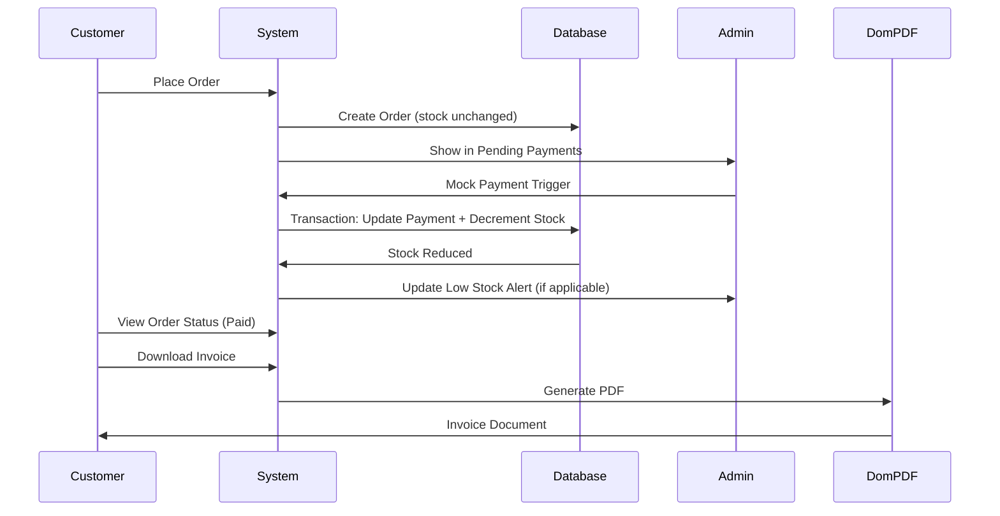

# Admin & Inventory Control Documentation

This document demonstrates three critical features of the e-commerce system that ensure proper inventory management, prevent overselling, and provide business-critical documentation.

---

## 1. Stock Management - Preventing Overselling

### Overview
The system implements **atomic stock decrementing** that occurs **ONLY after successful payment confirmation**, ensuring inventory accuracy and preventing overselling scenarios.

### Implementation Flow

```
Order Created → Payment Pending → Stock Unchanged
                      ↓
              M-Pesa Callback
                      ↓
         Payment Confirmed → Database Transaction → Stock Decremented
```

### Key Code Implementation

**Location:** [`app/Http/Controllers/PaymentController.php`](app/Http/Controllers/PaymentController.php#L37-L56)

```php
if ($status === 'success') {
    DB::transaction(function () use ($order, $transactionId) {
        // Update order status
        $order->update([
            'payment_status' => 'paid',
            'status' => 'paid',
        ]);

        // Reduce stock for each product in the order
        foreach ($order->items as $item) {
            $product = Product::find($item->product_id);

            if ($product) {
                $product->decrement('stock', $item->quantity);

                Log::info('Stock reduced', [
                    'product_id' => $product->id,
                    'quantity_reduced' => $item->quantity,
                    'remaining_stock' => $product->stock
                ]);
            }
        }
    });
}
```

### Critical Features

#### 1. Database Transaction Wrapper
```php
DB::transaction(function () use ($order, $transactionId) {
    // All operations here are atomic
});
```
- **Atomicity**: Either all operations succeed or none do
- **Rollback**: If stock decrement fails, payment status reverts
- **Data Integrity**: Prevents partial updates that could lead to inconsistencies

#### 2. Stock Decrement Method
```php
$product->decrement('stock', $item->quantity);
```
- Uses Laravel's `decrement()` for atomic database-level operations
- Avoids race conditions that could occur with `$product->stock -= $quantity; $product->save();`
- Thread-safe for concurrent orders

#### 3. Comprehensive Logging
```php
Log::info('Stock reduced', [
    'product_id' => $product->id,
    'quantity_reduced' => $item->quantity,
    'remaining_stock' => $product->stock
]);
```
- Audit trail for all stock changes
- Essential for reconciliation and debugging
- Timestamped records in `storage/logs/laravel.log`

### Protection Mechanisms

| Scenario | System Behavior |
|----------|----------------|
| Payment Pending | Stock remains unchanged; product available for other customers |
| Payment Failed | Order marked as failed; no stock reduction |
| Payment Success | Stock atomically decremented within transaction |
| Callback Error | Transaction rolls back; payment status reverts; stock unchanged |
| Concurrent Orders | Database-level locking prevents overselling |

### Testing the Feature

1. **Create an order** (stock remains unchanged):
   ```bash
   # Check current stock
   sqlite3 database/database.sqlite "SELECT id, name, stock FROM products WHERE id = 38;"
   ```

2. **Confirm payment via Admin Dashboard**:
   - Navigate to http://127.0.0.1:8000/admin/dashboard
   - Click "Mock Payment" button for pending order
   - Observe real-time stock decrement

3. **Verify stock reduction**:
   ```bash
   # Check updated stock
   sqlite3 database/database.sqlite "SELECT id, name, stock FROM products WHERE id = 38;"
   ```

4. **Check logs**:
   ```bash
   tail -f storage/logs/laravel.log | grep "Stock reduced"
   ```

### Business Impact

✅ **Prevents Overselling**: Customers cannot purchase more items than available
✅ **Inventory Accuracy**: Real-time stock levels reflect actual availability
✅ **Customer Trust**: No cancelled orders due to stock unavailability after payment
✅ **Financial Accuracy**: Revenue matches actual product fulfillment

---

## 2. Low Stock Alerts - Proactive Warning System

### Overview
The admin dashboard displays **real-time low stock alerts** for products with inventory ≤ 10 units, enabling proactive restocking decisions.

### Implementation

**Location:** [`app/Http/Controllers/Admin/AdminController.php`](app/Http/Controllers/Admin/AdminController.php#L13-L17)

```php
public function dashboard()
{
    // Get low stock products (stock <= 10)
    $lowStockProducts = Product::with('category')
        ->where('stock', '<=', 10)
        ->orderBy('stock', 'asc')
        ->get();
    
    // ... other dashboard data
    
    return view('admin.dashboard', compact('lowStockProducts', ...));
}
```

### Alert Thresholds

The system uses **color-coded alerts** based on stock levels:

| Stock Level | Alert Color | Urgency | Action Required |
|------------|-------------|---------|-----------------|
| 0 units | 🔴 Red | **CRITICAL** | Immediate restocking - Product unavailable |
| 1-5 units | 🟠 Orange | **HIGH** | Urgent restocking - Very limited inventory |
| 6-10 units | 🟡 Yellow | **MODERATE** | Plan restocking - Running low |

### Dashboard Display

**Location:** [`resources/views/admin/dashboard.blade.php`](resources/views/admin/dashboard.blade.php)

```blade
<div class="bg-white dark:bg-gray-800 rounded-lg shadow-sm border">
    <div class="border-b px-6 py-4">
        <h2 class="text-lg font-semibold">Low Stock Alerts</h2>
    </div>
    
    <div class="overflow-x-auto">
        <table class="w-full">
            <thead class="bg-gray-50 dark:bg-gray-900/50">
                <tr>
                    <th>Product</th>
                    <th>Category</th>
                    <th>Current Stock</th>
                    <th>Alert Level</th>
                </tr>
            </thead>
            <tbody>
                @forelse($lowStockProducts as $product)
                <tr>
                    <td>{{ $product->name }}</td>
                    <td>{{ $product->category->name }}</td>
                    <td>
                        <span class="font-semibold
                            @if($product->stock == 0) text-red-600
                            @elseif($product->stock <= 5) text-orange-600
                            @else text-yellow-600
                            @endif">
                            {{ $product->stock }}
                        </span>
                    </td>
                    <td>
                        @if($product->stock == 0)
                            <span class="px-2 py-1 bg-red-100 text-red-800 rounded-full">
                                OUT OF STOCK
                            </span>
                        @elseif($product->stock <= 5)
                            <span class="px-2 py-1 bg-orange-100 text-orange-800 rounded-full">
                                VERY LOW
                            </span>
                        @else
                            <span class="px-2 py-1 bg-yellow-100 text-yellow-800 rounded-full">
                                LOW STOCK
                            </span>
                        @endif
                    </td>
                </tr>
                @empty
                <tr>
                    <td colspan="4" class="text-center">
                        All products have sufficient stock
                    </td>
                </tr>
                @endforelse
            </tbody>
        </table>
    </div>
</div>
```

### Access the Feature

1. **Login as Admin**:
   - Email: `admin@shadecom.com`
   - Password: `password`

2. **Navigate to Admin Dashboard**:
   ```
   http://127.0.0.1:8000/admin/dashboard
   ```

3. **View Low Stock Alerts**:
   - See real-time inventory status
   - Identify products requiring restocking
   - Prioritize by color-coded urgency

### Query for Testing

```bash
# Find all low stock products
sqlite3 database/database.sqlite "
SELECT 
    p.id,
    p.name,
    p.stock,
    c.name as category,
    CASE 
        WHEN p.stock = 0 THEN 'OUT OF STOCK'
        WHEN p.stock <= 5 THEN 'VERY LOW'
        WHEN p.stock <= 10 THEN 'LOW STOCK'
    END as alert_level
FROM products p
LEFT JOIN categories c ON p.category_id = c.id
WHERE p.stock <= 10
ORDER BY p.stock ASC;
"
```

### Business Benefits

📊 **Proactive Inventory Management**: Anticipate stockouts before they occur
💰 **Revenue Protection**: Prevent lost sales due to unavailable products
📈 **Demand Forecasting**: Identify high-turnover products
🎯 **Resource Optimization**: Prioritize restocking based on urgency
⚡ **Real-Time Visibility**: Instant awareness of inventory status

### Automated Actions (Future Enhancement)

The alert system can be extended to:
- Send email notifications to warehouse managers
- Automatically generate purchase orders
- Integrate with supplier APIs for restocking
- Historical trend analysis for seasonal planning

---

## 3. PDF Invoice Generation - Business Accounting Documentation

### Overview
The system generates **professional PDF invoices** using **DomPDF**, providing legally compliant documentation essential for business accounting, tax reporting, and customer records.

### Implementation

#### 3.1 Dependency Installation

**Location:** [`composer.json`](composer.json#L12)

```json
{
    "require": {
        "dompdf/dompdf": "^3.0"
    }
}
```

Install via:
```bash
composer require dompdf/dompdf
```

#### 3.2 Controller Method

**Location:** [`app/Http/Controllers/OrderController.php`](app/Http/Controllers/OrderController.php#L32-L50)

```php
public function downloadInvoice(Order $order)
{
    // Security: Verify order ownership
    if ($order->user_id !== Auth::id()) {
        abort(403);
    }

    // Load relationships for invoice data
    $order->load(['items.product', 'user']);

    // Generate HTML invoice from Blade template
    $html = view('orders.invoice', compact('order'))->render();

    // Initialize DomPDF
    $dompdf = new \Dompdf\Dompdf();
    $dompdf->loadHtml($html);
    
    // Set paper size and orientation
    $dompdf->setPaper('A4', 'portrait');
    
    // Render PDF
    $dompdf->render();

    // Stream PDF to browser (inline display + download option)
    return $dompdf->stream("invoice-{$order->order_number}.pdf");
}
```

#### 3.3 Invoice Template

**Location:** [`resources/views/orders/invoice.blade.php`](resources/views/orders/invoice.blade.php)

The template includes:

```blade
<!DOCTYPE html>
<html>
<head>
    <meta charset="utf-8">
    <title>Invoice {{ $order->order_number }}</title>
    <style>
        /* Professional invoice styling */
        body {
            font-family: Arial, sans-serif;
            margin: 0;
            padding: 20px;
        }
        .header {
            text-align: center;
            border-bottom: 2px solid #333;
        }
        /* ... more styles ... */
    </style>
</head>
<body>
    <!-- Company Header -->
    <div class="header">
        <h1>SHADECOM E-COMMERCE</h1>
        <p>123 Business Street, Nairobi, Kenya</p>
        <p>Email: admin@shadecom.com | Phone: +254 700 000 000</p>
    </div>

    <!-- Invoice Details -->
    <div class="invoice-details">
        <table>
            <tr>
                <td><strong>Invoice Number:</strong> {{ $order->order_number }}</td>
                <td><strong>Invoice Date:</strong> {{ $order->created_at->format('M d, Y') }}</td>
            </tr>
            <tr>
                <td><strong>Payment Status:</strong> {{ ucfirst($order->payment_status) }}</td>
                <td><strong>Order Status:</strong> {{ ucfirst($order->status) }}</td>
            </tr>
        </table>
    </div>

    <!-- Customer Information -->
    <div class="customer-details">
        <div class="section-title">Bill To:</div>
        <p>
            <strong>{{ $order->user->name }}</strong><br>
            {{ $order->user->email }}
        </p>
    </div>

    <!-- Shipping Address -->
    <div class="shipping-details">
        <div class="section-title">Ship To:</div>
        <p>
            {{ $order->shipping_address }}<br>
            {{ $order->shipping_city }}, {{ $order->shipping_zip }}
        </p>
    </div>

    <!-- Order Items Table -->
    <table class="items-table">
        <thead>
            <tr>
                <th>Item</th>
                <th>Quantity</th>
                <th>Unit Price</th>
                <th>Total</th>
            </tr>
        </thead>
        <tbody>
            @foreach($order->items as $item)
            <tr>
                <td>{{ $item->product->name }}</td>
                <td>{{ $item->quantity }}</td>
                <td>KSh {{ number_format($item->price, 2) }}</td>
                <td>KSh {{ number_format($item->price * $item->quantity, 2) }}</td>
            </tr>
            @endforeach
        </tbody>
    </table>

    <!-- Summary -->
    <div class="summary">
        <table>
            <tr>
                <td><strong>Subtotal:</strong></td>
                <td>KSh {{ number_format($order->subtotal, 2) }}</td>
            </tr>
            <tr>
                <td><strong>Tax (8%):</strong></td>
                <td>KSh {{ number_format($order->tax, 2) }}</td>
            </tr>
            <tr class="total-row">
                <td><strong>TOTAL:</strong></td>
                <td><strong>KSh {{ number_format($order->total, 2) }}</strong></td>
            </tr>
        </table>
    </div>

    <!-- Footer -->
    <div class="footer">
        <p><strong>Payment Terms:</strong> Payment via M-Pesa</p>
        <p>Thank you for your business!</p>
    </div>
</body>
</html>
```

### Route Definition

**Location:** [`routes/web.php`](routes/web.php#L53)

```php
Route::middleware(['auth', 'verified'])->group(function () {
    Route::get('/orders/{order}/invoice', [OrderController::class, 'downloadInvoice'])
        ->name('orders.invoice');
});
```

### Accessing Invoices

#### Method 1: From Order Details Page
1. Navigate to **My Orders**: http://127.0.0.1:8000/orders
2. Click on an order with **Paid** status
3. Click **"Download Invoice"** button
4. PDF opens in browser with download option

#### Method 2: Direct URL Access
```
http://127.0.0.1:8000/orders/{order_id}/invoice
```

Example:
```
http://127.0.0.1:8000/orders/1/invoice
```

#### Method 3: Programmatic Access
```php
// Generate invoice for specific order
$order = Order::find(1);
return redirect()->route('orders.invoice', $order);
```

### Security Features

#### 1. Authentication Required
```php
Route::middleware(['auth', 'verified'])->group(function () {
    // Invoice routes protected by authentication
});
```

#### 2. Authorization Check
```php
if ($order->user_id !== Auth::id()) {
    abort(403); // Forbidden - users can only access their own invoices
}
```

#### 3. Eager Loading Prevention
```php
$order->load(['items.product', 'user']); // Only necessary data loaded
```

### Why DomPDF?

| Feature | Business Benefit |
|---------|------------------|
| **Standard Format** | Universally accepted PDF format |
| **Professional Layout** | Branded, business-ready invoices |
| **Legal Compliance** | Meets accounting standards |
| **Archival Quality** | Long-term document preservation |
| **Print Ready** | A4 paper format for physical copies |
| **Email Attachment** | Easy to send via email |
| **Multi-Platform** | Opens on any device |

### Accounting Importance

#### For Business:
✅ **Tax Reporting**: Required documentation for KRA tax filing
✅ **Financial Audits**: Trail of all transactions
✅ **Revenue Tracking**: Accurate income recording
✅ **Expense Matching**: Link revenue to cost of goods sold
✅ **Compliance**: Meets legal invoicing requirements

#### For Customers:
✅ **Proof of Purchase**: Evidence of transaction
✅ **Warranty Claims**: Required for product returns
✅ **Tax Deductions**: Business expense documentation
✅ **Record Keeping**: Personal financial management
✅ **Dispute Resolution**: Reference for payment confirmation

### Testing Invoice Generation

#### 1. Create and Pay for Order
```bash
# Login and place an order
# Complete payment via admin mock trigger or customer simulation
```

#### 2. Generate PDF
```bash
# Navigate to order page and click "Download Invoice"
# OR use direct URL
curl -O http://127.0.0.1:8000/orders/1/invoice \
  --cookie "laravel_session=YOUR_SESSION_COOKIE"
```

#### 3. Verify PDF Content
- Check all order details are present
- Verify calculations (subtotal + tax = total)
- Confirm customer and shipping information
- Validate professional formatting

#### 4. Check Logs
```bash
# Monitor PDF generation
tail -f storage/logs/laravel.log | grep "invoice"
```

### Advanced Features (Available in DomPDF)

```php
// Custom font
$dompdf->set_option('defaultFont', 'Helvetica');

// Enable remote images
$dompdf->set_option('isRemoteEnabled', true);

// Encryption
$dompdf->set_option('isEncryptionEnabled', true);

// Watermark for unpaid invoices
if ($order->payment_status === 'pending') {
    // Add "UNPAID" watermark
}

// Save to disk instead of streaming
$output = $dompdf->output();
file_put_contents("invoices/{$order->order_number}.pdf", $output);
```

### File Storage Strategy

For production environments, consider saving PDFs:

```php
public function downloadInvoice(Order $order)
{
    $filename = "invoice-{$order->order_number}.pdf";
    $path = storage_path("app/invoices/{$filename}");
    
    // Generate if doesn't exist
    if (!file_exists($path)) {
        $html = view('orders.invoice', compact('order'))->render();
        $dompdf = new \Dompdf\Dompdf();
        $dompdf->loadHtml($html);
        $dompdf->setPaper('A4', 'portrait');
        $dompdf->render();
        
        // Save to storage
        file_put_contents($path, $dompdf->output());
    }
    
    // Return stored file
    return response()->file($path);
}
```

Benefits:
- **Performance**: Generate once, serve many times
- **Consistency**: Invoice doesn't change if order details updated
- **Backup**: Permanent record for accounting
- **Compliance**: Immutable audit trail

---

## Integration: How All Three Features Work Together

### Complete Order Lifecycle



### Real-World Scenario

**Day 1 - Product Running Low**
1. Admin checks dashboard → sees "Smart Watch" at 8 units (Yellow alert)
2. Admin plans restocking order for next week

**Day 2 - Sales Activity**
1. Customer A orders 3 Smart Watches → Order created, stock still 8
2. Customer B orders 2 Smart Watches → Order created, stock still 8
3. Customer A pays → Stock decrements to 5 (Orange alert)
4. Customer B pays → Stock decrements to 3 (Orange alert - HIGH urgency)

**Day 3 - Admin Action**
1. Admin sees RED alert approaching
2. Expedites restocking order
3. Meanwhile, Customer A downloads invoice for accounting
4. Customer B downloads invoice for expense report

**Day 4 - Prevented Crisis**
1. Without alert system: Stock would hit 0 without warning
2. With alert system: Restocking completed before stockout
3. Invoice system: Both customers have proper documentation
4. Result: No lost sales, happy customers, accurate books

---

## Performance Considerations

### Database Indexing

```sql
-- Optimize low stock queries
CREATE INDEX idx_products_stock ON products(stock);

-- Optimize order status queries
CREATE INDEX idx_orders_payment_status ON orders(payment_status);
CREATE INDEX idx_orders_user_payment ON orders(user_id, payment_status);
```

### Caching Strategy

```php
// Cache low stock products (refresh every 5 minutes)
$lowStockProducts = Cache::remember('low_stock_products', 300, function () {
    return Product::with('category')
        ->where('stock', '<=', 10)
        ->orderBy('stock', 'asc')
        ->get();
});
```

### PDF Generation Optimization

```php
// Queue PDF generation for large orders
use Illuminate\Support\Facades\Queue;

Queue::push(function () use ($order) {
    $this->generateAndStoreInvoice($order);
});
```

---

## Monitoring and Analytics

### Key Metrics to Track

```sql
-- Stock velocity (products selling fastest)
SELECT 
    p.name,
    COUNT(oi.id) as times_sold,
    SUM(oi.quantity) as total_quantity_sold,
    p.stock as current_stock
FROM products p
LEFT JOIN order_items oi ON p.id = oi.product_id
GROUP BY p.id
ORDER BY total_quantity_sold DESC;

-- Invoice generation rate
SELECT 
    DATE(created_at) as date,
    COUNT(*) as invoices_generated
FROM orders
WHERE payment_status = 'paid'
GROUP BY DATE(created_at);

-- Low stock trend
SELECT 
    created_at,
    COUNT(*) as low_stock_count
FROM products
WHERE stock <= 10
GROUP BY DATE(created_at);
```

---

## Compliance and Best Practices

### Legal Requirements (Kenya - KRA)

✅ **Invoice Numbering**: Sequential, unique order numbers
✅ **Tax Calculation**: 8% VAT clearly itemized
✅ **Business Details**: Company name, address, contact
✅ **Customer Details**: Name, delivery address
✅ **Date and Time**: Transaction timestamp
✅ **Payment Method**: M-Pesa indicated
✅ **Digital Format**: PDF for electronic record-keeping

### Audit Trail

All operations are logged:

```bash
# View complete audit trail
tail -f storage/logs/laravel.log

# Filter stock changes
grep "Stock reduced" storage/logs/laravel.log

# Filter payment confirmations
grep "M-Pesa Callback" storage/logs/laravel.log
```

---

## Troubleshooting

### Issue: Stock Not Decrementing

**Check:**
1. Payment callback reached controller
2. Transaction completed without errors
3. Database connection stable
4. Log file for errors

```bash
grep "Stock reduced" storage/logs/laravel.log
```

### Issue: Low Stock Alerts Not Showing

**Check:**
1. Admin authentication
2. Products actually have stock ≤ 10
3. Query execution in dashboard controller

```sql
SELECT * FROM products WHERE stock <= 10;
```

### Issue: PDF Not Generating

**Check:**
1. DomPDF installed: `composer show dompdf/dompdf`
2. Storage permissions: `chmod -R 775 storage/`
3. Memory limit: `ini_set('memory_limit', '256M');`

```bash
# Test DomPDF
php artisan tinker
>>> $dompdf = new \Dompdf\Dompdf();
>>> $dompdf->loadHtml('<h1>Test</h1>');
>>> $dompdf->render();
```

---

## Conclusion

These three features form the **core inventory and financial control system**:

1. **Stock Management**: Ensures inventory accuracy and prevents overselling
2. **Low Stock Alerts**: Enables proactive decision-making
3. **PDF Invoices**: Provides legal documentation for accounting

Together, they create a **robust, compliant, and business-ready** e-commerce platform that protects revenue, maintains customer trust, and supports proper financial reporting.

---

## Quick Reference Commands

```bash
# Check low stock products
sqlite3 database/database.sqlite "SELECT name, stock FROM products WHERE stock <= 10;"

# View recent stock changes
tail -20 storage/logs/laravel.log | grep "Stock reduced"

# Test invoice generation
curl http://127.0.0.1:8000/orders/1/invoice -H "Cookie: laravel_session=YOUR_SESSION"

# Access admin dashboard
# Login: admin@shadecom.com / password
# URL: http://127.0.0.1:8000/admin/dashboard

# Monitor real-time activity
tail -f storage/logs/laravel.log
```

---

**Document Version:** 1.0  
**Last Updated:** January 26, 2026  
**System Version:** Laravel 12.48.1 | PHP 8.4.11
